# Nutty

<p align="center">
  
</p>


<p align="center">
  <b>A native, high-performance terminal built with C/C++</b><br/>
  <i>Fast. Lightweight. Pure.</i>
</p>

---

## ✨ What is Nutty

Nutty 是一个**原生终端应用**，使用 **C / C++** 构建。

没有 Electron，没有臃肿框架，专注于：

> **极致性能 + 极简体验**

如果终端是你的主要工作工具，Nutty 希望成为一个更顺手、更流畅的选择。

Nutty 的目标就是回归本质：

- 使用原生技术栈（C/C++）
- 优化字符处理路径
- 极致降低资源占用
- 提供流畅的终端体验

---

## ⚡ Features

### 🖥 Terminal Experience

- 本地 Shell 开箱即用

- 多标签页
- 自由分屏（水平 / 垂直 / 拖拽重排）
- 支持 UTF-8 / Emoji / Grapheme Cluster

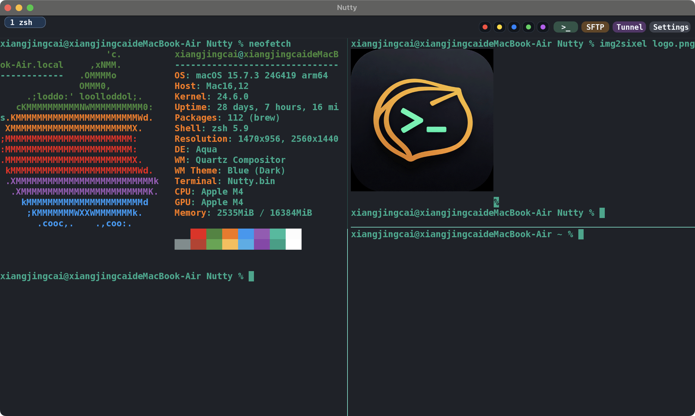

---

### 🔍 Powerful Search

- 实时高亮匹配内容
- 快速定位输出结果

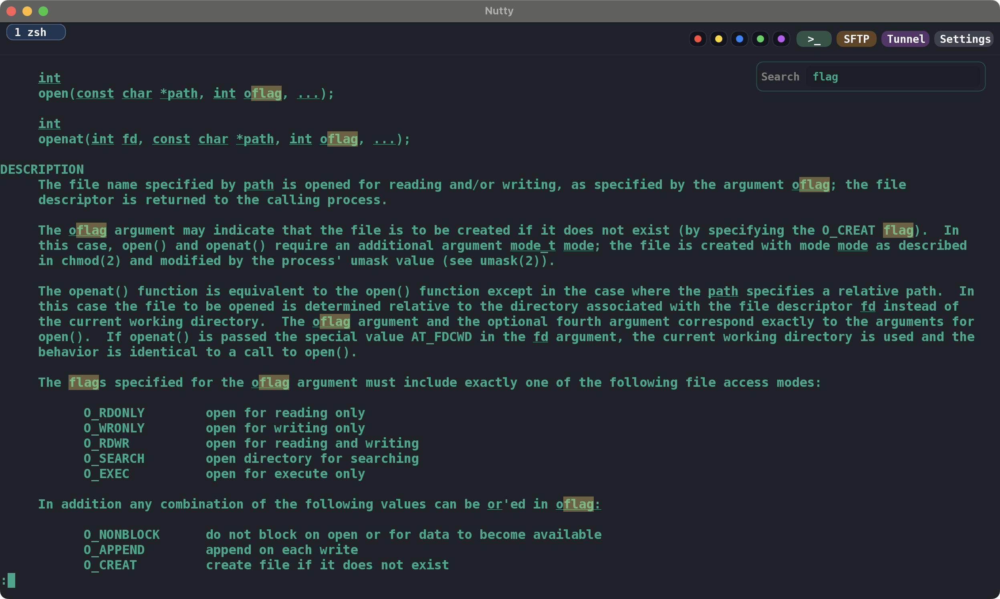

---

### 🌐 SSH / SFTP / Network

- SSH 支持：
  - 密码登录
  - 私钥认证
  - 跳板机（Jump Host）
  - TOTP 多因素认证
- 内置 SFTP
- 端口转发（Port Tunnel）

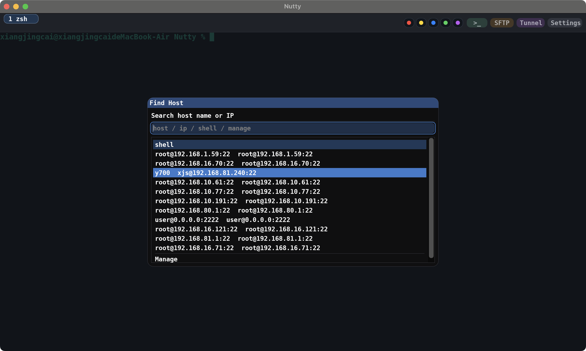

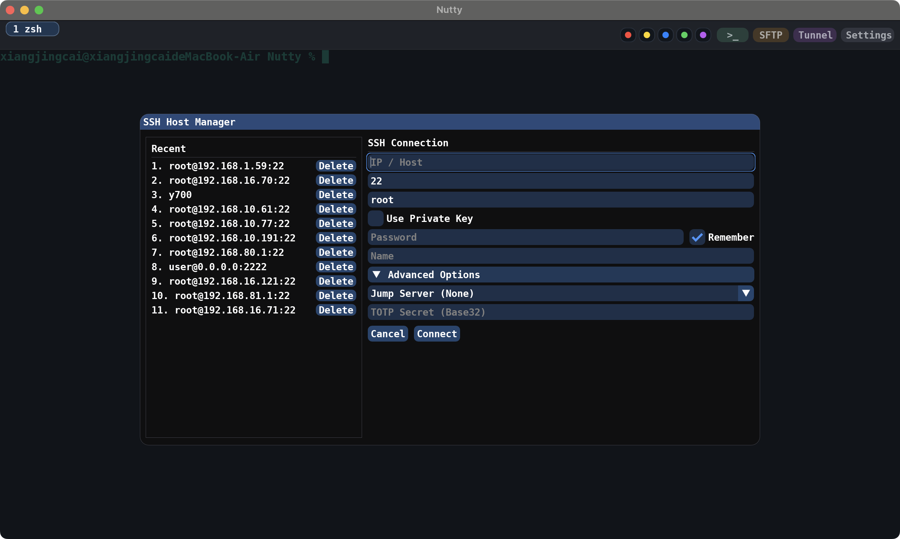

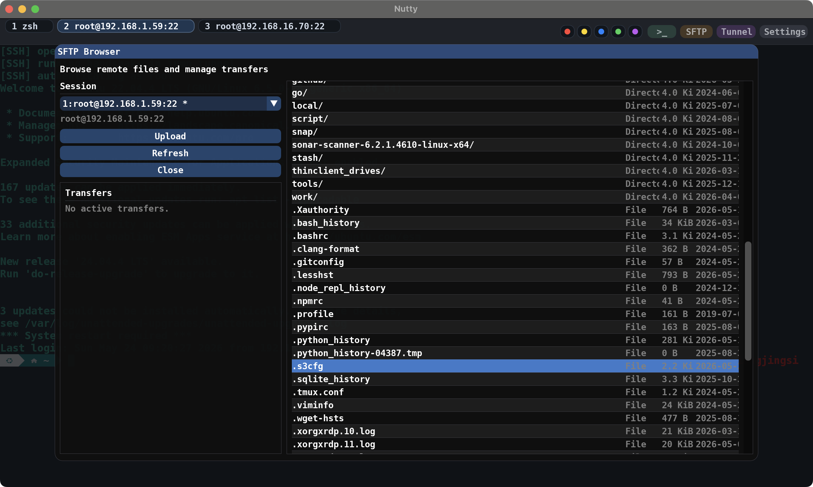

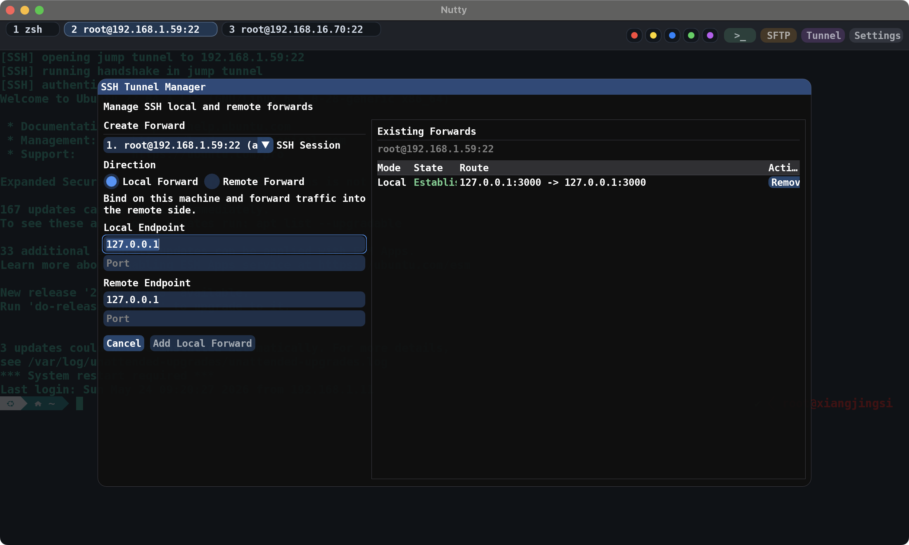

---

### 📦 Zmodem

内置经典 **Zmodem 协议**：

- `rz` / `sz` 直接传输文件
- 支持跨多层跳板机

在复杂网络环境下依然非常实用。

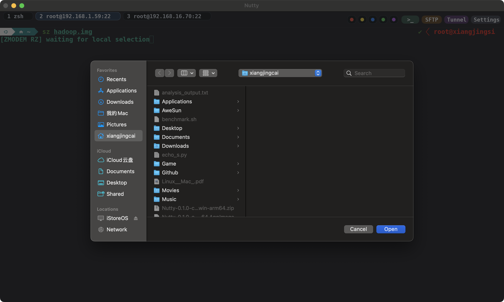

---

### 🎨 Customization

- 多主题
- 字体配置
- 历史记录设置

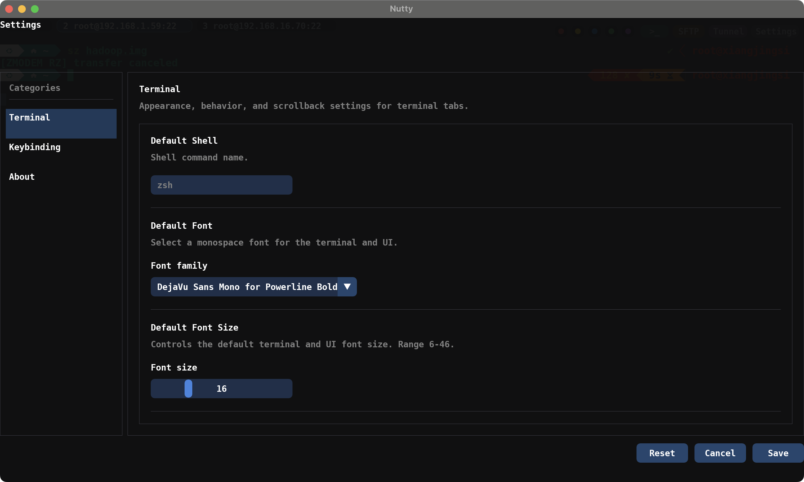

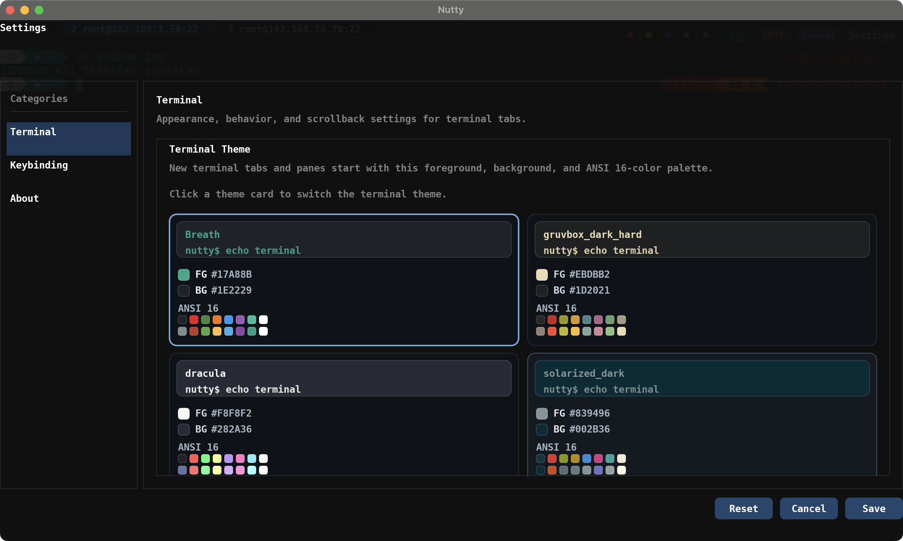

---

## 📊 Performance

```bash
$ bash benchmark.sh wrap
$ bash benchmark.sh nowrap
```

测试模式：

- wrap（自动换行）

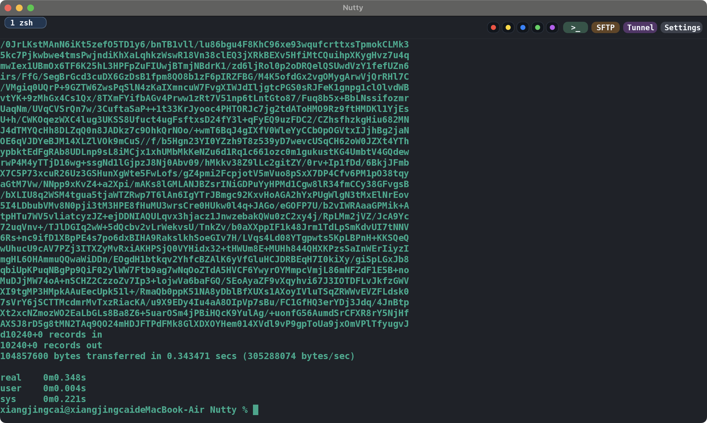

- nowrap（不换行）

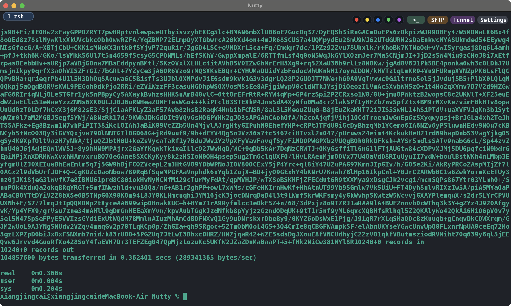

## keyboard shortcuts

| 操作 | macOS | Linux / Windows | 说明 |
| --- | --- | --- | --- |
| 切换到第 1-10 个标签页 | `Cmd+1` ... `Cmd+0` | `Alt+1` ... `Alt+0` | `0` 表示第 10 个标签页 |
| 粘贴 | `Cmd+v` | `Ctrl+Shift+V` | 搜索框获取焦点时不会处理该操作 |
| 复制选中内容 | `Cmd+c` | `Ctrl+Shift+c` | 复制当前终端选中的文本 |
| 按页滚动终端历史 | `Shift+PageUp` / `Shift+PageDown` | `Shift+PageUp` / `Shift+PageDown` | 仅本地滚动，不会发送到 shell |
| 调整字体大小 | `Cmd+=` / `Cmd+-` | `Ctrl+=` / `Ctrl+-` | 字体范围为 `6-46` |
| 左右分屏 | `Cmd+s` | `Ctrl+Shift+s` | 在当前标签页中创建一个新的终端面板 |
| 上下分屏 | `Cmd+'` | `Ctrl+Shift+'` | 如果当前是 SSH 会话，新面板会复用该连接 |
| 拖拽终端面板 | `Cmd+鼠标左键拖拽` | `Alt+鼠标左键拖拽` | 至少需要两个面板；拖到其他面板可交换，拖到标签栏可新建标签页 |
| 打开主机搜索 | `Cmd+t` | `Ctrl+Shift+t` | 打开主机选择器（SSH / 本地 / 历史记录） |
| 打开搜索 | `Cmd+f` | `Ctrl+Shift+f` | 聚焦到搜索输入框 |
| 查找下一个 / 上一个 | `Cmd+]` / `Cmd+[` | `Ctrl+Shift+]` / `Ctrl+Shift+[` | 基于当前搜索内容 |
| 退出搜索 | `Enter` / `Esc` | `Enter` / `Esc` | `Enter` 保留搜索，`Esc` 退出搜索模式 |


## 当前阶段

产品当前处于公测阶段，公测截止时间为2026-08-01 00:00。

欢迎大家尝试使用，反馈意见。

## 交流群

QQ群：2159071971
