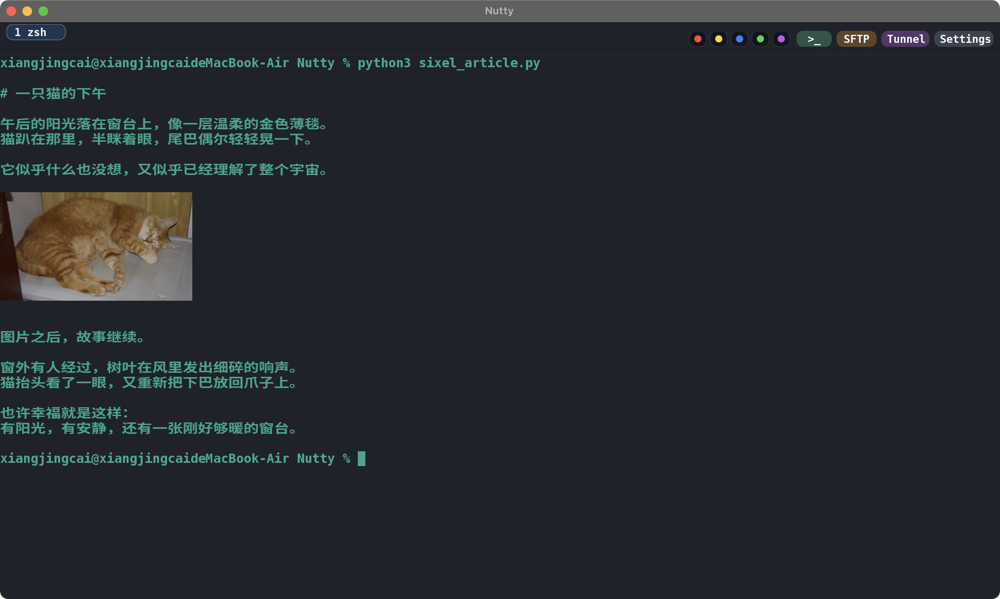
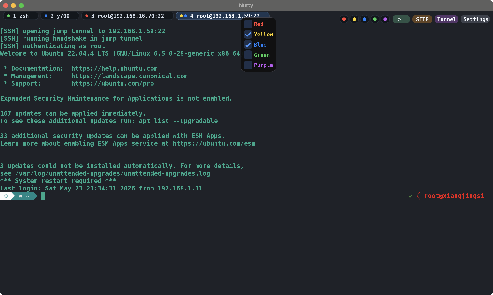
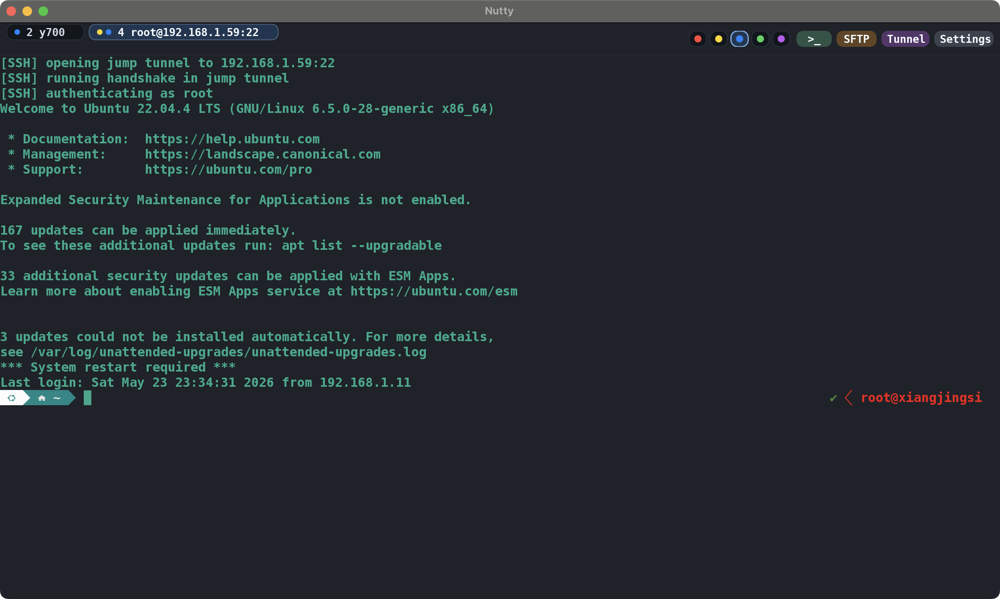
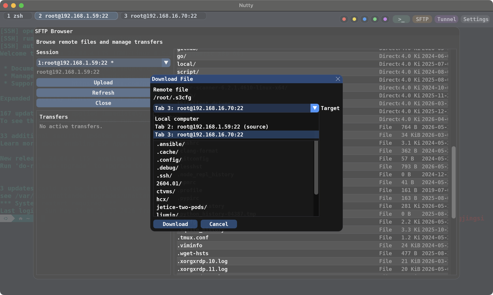
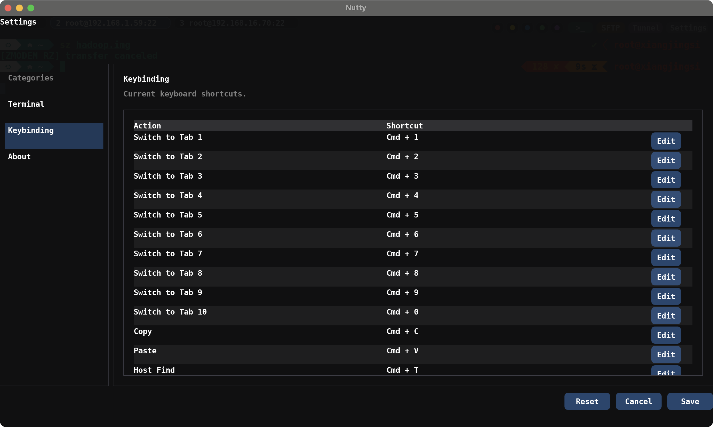

# Nutty

<p align="center">
  
</p>


<p align="center">
  <b>A native terminal built with C/C++</b><br/>
  <i>Lightweight. Practical. Pure.</i>
</p>

---

## ✨ What is Nutty

Nutty 是一个**原生终端应用**，使用 **C / C++** 构建。

没有 Electron，没有臃肿框架，专注于：

> **极致性能 + 极简体验**

如果终端是你的主要工作工具，Nutty 希望成为一个更顺手、更流畅的选择。

Nutty 的目标就是回归本质：

- 使用原生技术栈（C/C++）
- 覆盖本地终端、SSH、SFTP 等常用工作流
- 提供清爽直接的终端体验
- 保持配置简单、功能实用

---

## ⚡ Features

### 🖥 Terminal Experience

- 本地 Shell 开箱即用
- 自由分屏（水平 / 垂直 / 拖拽重排）
- 支持 UTF-8 / Emoji / Grapheme Cluster
- 支持右键菜单、URL 打开和选区复制


---

### 🖼 Sixel Image

- 支持 sixel，终端内可直接显示图片
- 图片作为终端内容的一部分显示，会跟随终端内容一起滚动
- 适合命令行图片预览、远程 SSH 环境查看图片等场景



---

### 🗂 Tab Management

- 支持多标签页管理
- 标签页拖拽重排
- 标签页彩色标记
- 支持按颜色过滤标签页，方便区分生产、测试、开发等不同环境
- 终端面板可以拖到标签栏，快速拆成新的标签页





---

### 🔍 Powerful Search

- 实时高亮匹配内容
- 快速定位输出结果
- 支持上一个 / 下一个匹配跳转


---

### 🌐 SSH

- 密码登录
- 私钥认证
- 跳板机（Jump Host）
- TOTP 多因素认证
- 主机搜索和主机管理
- SSH 会话复制


---

### 📁 SFTP

- 远程目录浏览
- 上传文件
- 下载文件到本机
- 服务器之间 P2P 传输文件
- 传输进度查看和取消




---

### 🚇 Port Tunnel

- 支持 SSH 端口转发
- 适合访问远程内网服务、数据库、开发服务等场景


---

### 📦 Zmodem

内置经典 **Zmodem 协议**：

- `rz` / `sz` 直接传输文件
- 支持跨多层跳板机

在复杂网络环境下依然非常实用。


---

### 🎨 Customization

- 多主题
- 系统字体配置
- 默认 shell 配置
- 历史记录设置
- 快捷键配置，支持修改、删除和清空快捷键
- 鼠标相关操作配置，例如拖拽终端、打开 URL、复制选区


---

## Keybinding

支持在设置页中自定义多种快捷键，包括标签页切换、复制粘贴、搜索、分屏、字体缩放、关闭标签页、拖拽终端、打开 URL、复制选区等常用操作。



---

## 📊 Performance

```bash
$ bash benchmark.sh wrap
$ bash benchmark.sh nowrap
```

测试模式：

- wrap（自动换行）


- nowrap（不换行）


## 当前阶段

产品当前处于公测阶段，公测截止时间为2026-08-01 00:00。

欢迎大家尝试使用，反馈意见。

## 交流群

QQ群：2159071971
