# Nutty

  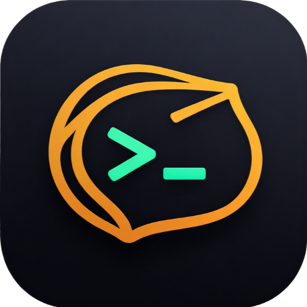

  <b>A native terminal built with C/C++</b> 
  <i>Lightweight. Practical. Pure.</i>

Nutty 是一个使用 **C / C++** 构建的原生终端应用，支持 macOS、Windows 和 Linux。把本地 Shell、SSH、SFTP、串口和 Telnet 放在同一个工作区，保持轻量，专注日常终端工作。

[官方网站](https://nutty.net.cn) · [GitHub 下载](https://github.com/xiangjs6/Nutty/releases/latest) · [Gitee 下载](https://gitee.com/xiangjs/Nutty/releases/latest)

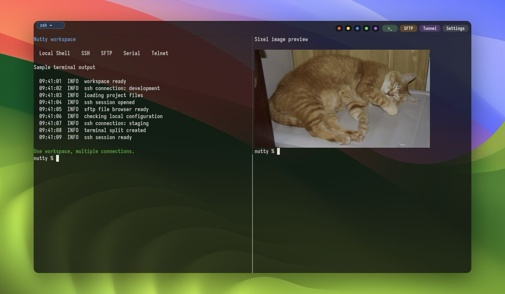

## 终端与工作区

- 本地 Shell、多标签页、上下 / 左右分屏与拖拽重排，也可以通过终端右键菜单直接分屏。
- 标签页彩色标记、按颜色过滤，方便区分不同环境。
- 终端面板可以拖到标签栏，拆成独立标签页。
- 支持 UTF-8、Emoji、Grapheme Cluster、URL 打开和选区复制。
- 搜索终端输出，实时高亮并跳转到上一个 / 下一个匹配。
- **同步输入**：将输入发送到参与同步的终端，便于同时操作多个会话。
- **会话恢复**：可配置启动时恢复上次的标签页和分屏布局。
- **全局唤起**：通过可自定义的快捷键显示或隐藏 Nutty。

## 文本搜索

输入关键词即可高亮终端输出中的匹配内容，并在匹配结果之间跳转。

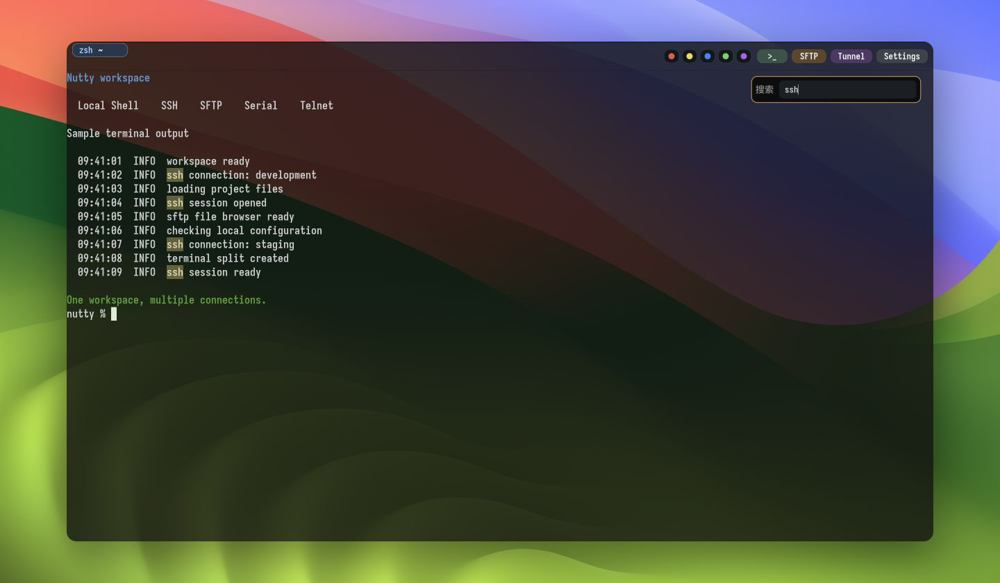

## 主机搜索

按主机名称或地址快速筛选已保存的连接，也可从同一入口打开本地 Shell 或进入主机管理。

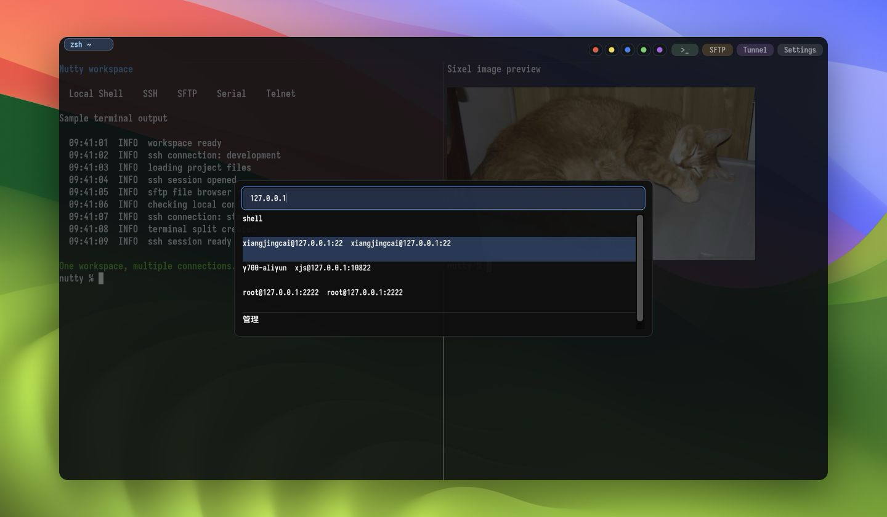

## SSH、SFTP 与端口转发

- SSH 支持密码、私钥、跳板机、TOTP 多因素认证和 X11 转发。
- 主机搜索、最近连接管理和会话复制。
- SFTP 远程目录浏览、上传、下载和服务器之间的 P2P 文件传输。
- 查看传输进度，取消传输任务。
- SSH 端口转发，便于访问远程内网服务、数据库和开发服务。

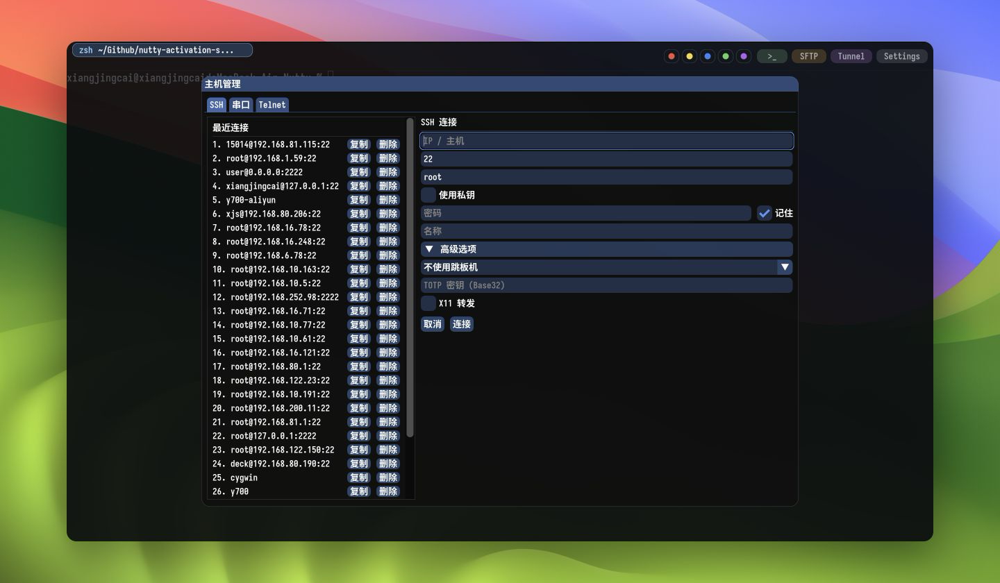

## 串口与 Telnet

在主机管理中切换 SSH、串口与 Telnet，使用同一套终端工作区管理不同连接。

**串口**支持设备选择、波特率、数据位、停止位、校验位和流控配置，适合设备调试。

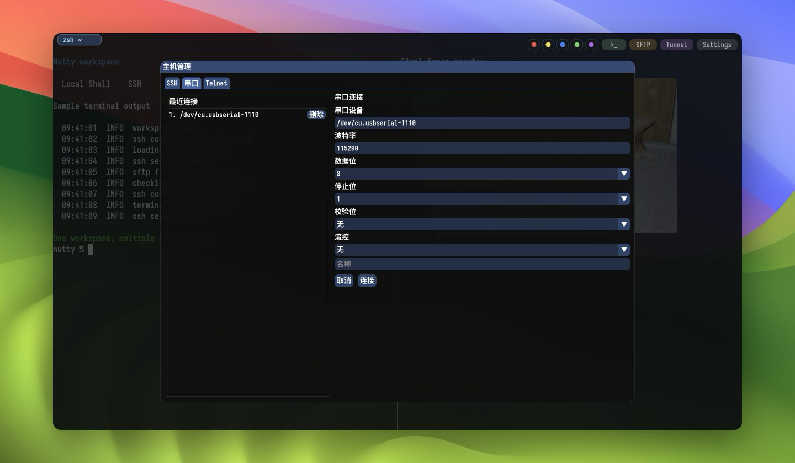

**Telnet** 支持主机、端口与连接名称配置，适合需要 Telnet 的设备或测试环境。

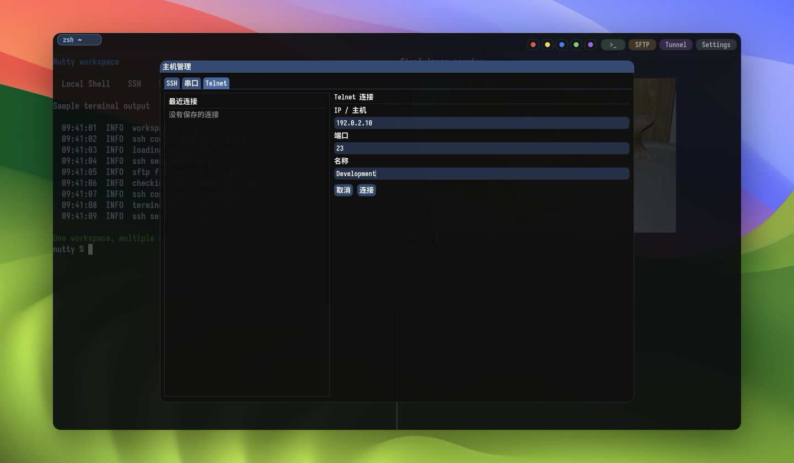

## 终端图片与文件传输

- **Sixel / Kitty Graphics**：在终端内显示图片，便于命令行预览和远程查看。
- Sixel 图片随终端内容一起滚动。
- **Zmodem**：内置 `rz` / `sz` 文件传输，支持多层 SSH 跳板场景。

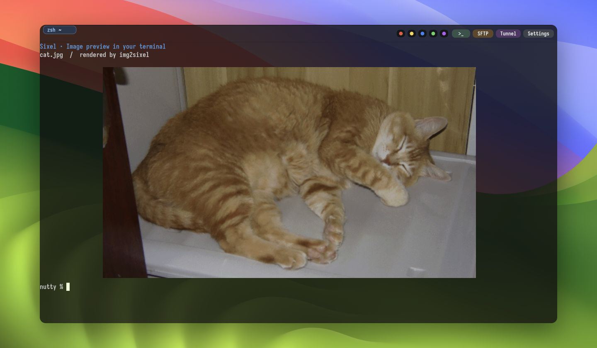

## 背景透明度

在终端设置中调整背景不透明度，让工作区在通透感与文字清晰度之间取得平衡。

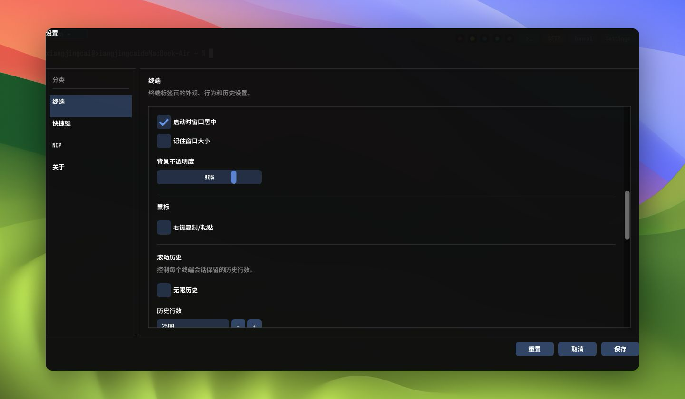

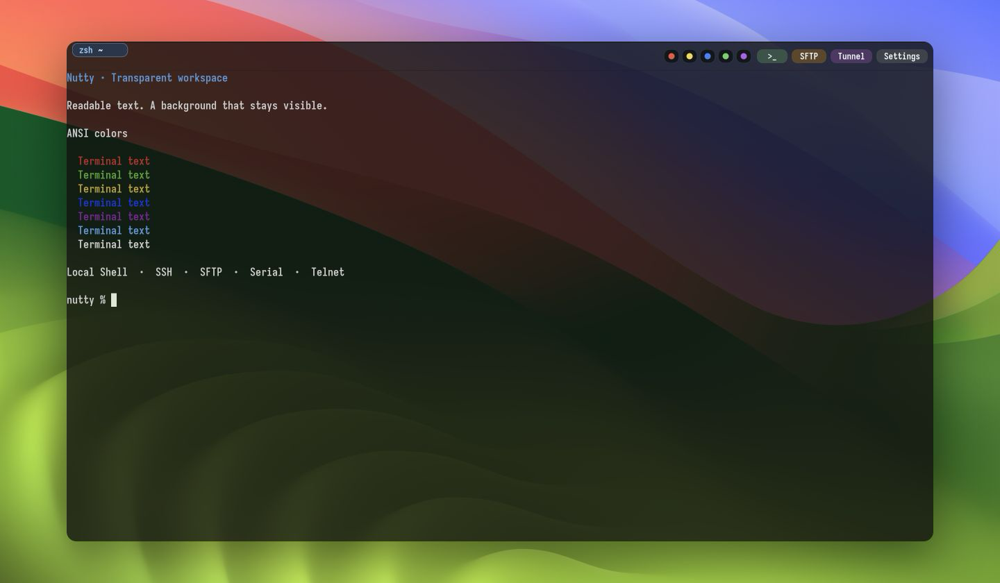

## 外观与快捷键

- 中文 / 英文界面、默认 Shell、历史记录与会话恢复设置。
- 通用字体与 ANSI 字体分别配置，也可让 ANSI 字体跟随通用字体。
- 预设主题与自定义终端颜色。
- 快捷键可编辑，涵盖全局唤起、标签切换、复制粘贴、搜索、分屏、缩放等操作。
- 可配置拖拽终端、打开 URL 和复制选区等鼠标操作。

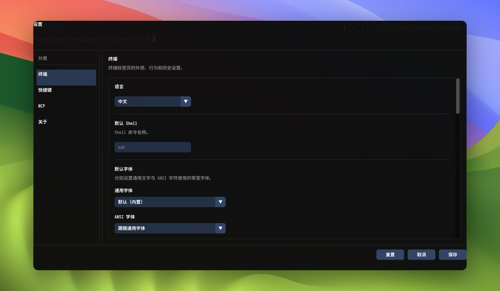

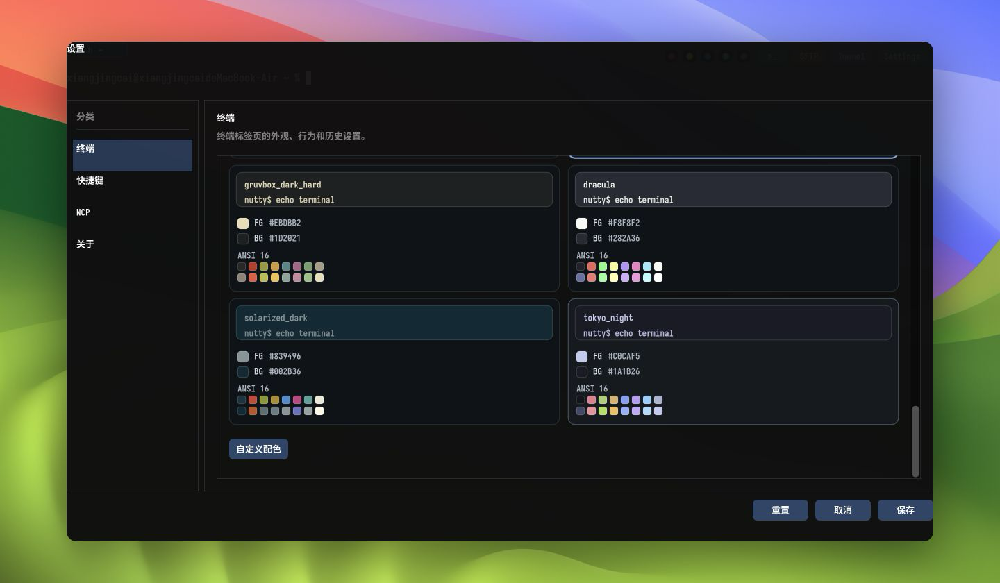

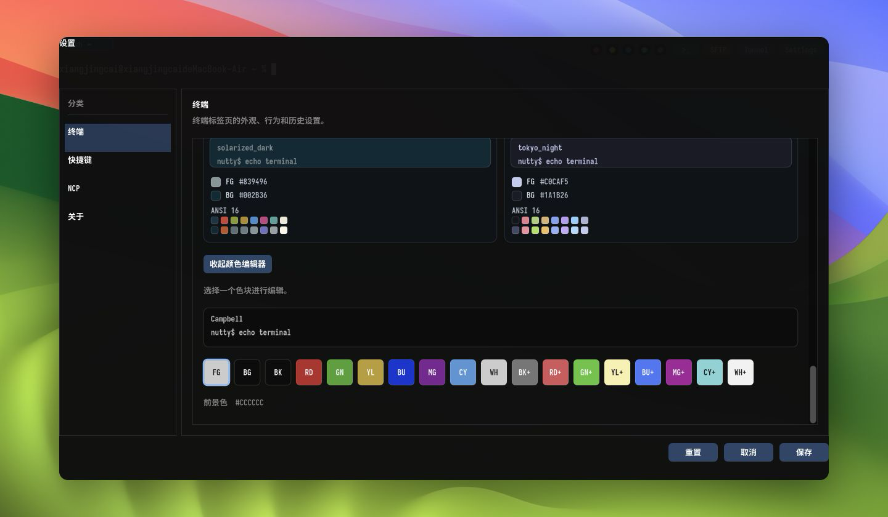

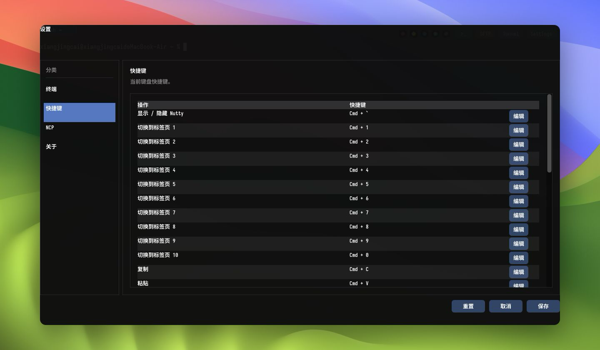

## NCP：让 AI 工具协作操作终端

**连接 NCP 后，兼容的 AI 工具会自动获取 Nutty 内置的使用说明，学习如何使用 NCP。** 你只需连接并完成授权，就可以用自然语言让 AI 读取终端内容、执行命令或管理工作区，无需手动向它讲解协议和调用方式。

Nutty Control Protocol（NCP）为兼容的 AI 工具和自动化客户端提供终端访问能力：

- 枚举标签页与终端，读取终端文本和输出。
- 打开终端、切换焦点、发送输入。
- 支持关闭、跟随和后台操作模式。
- 在设置中查看连接状态、配置监听地址和端口，并撤销客户端授权。

使用前需要启用 NCP，并按实际需要配置客户端授权。

[观看 NCP 使用教学视频](https://www.bilibili.com/video/BV1fYuV68E6W/)

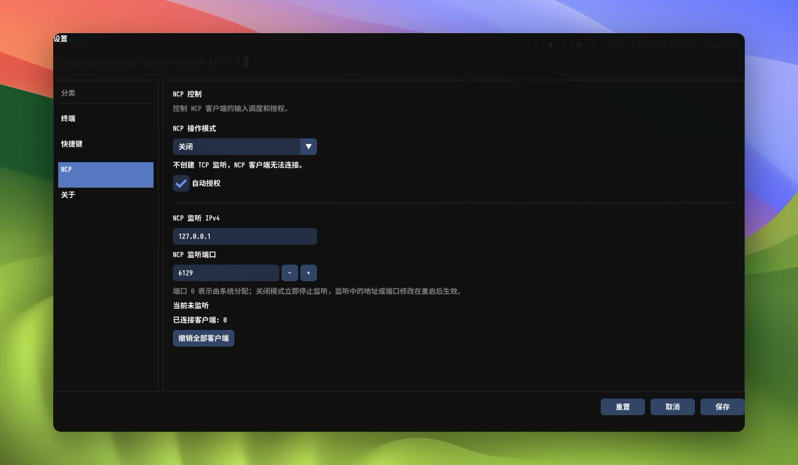

## 性能测试

### vtebench

以下结果来自 Nutty 的 [vtebench 测试](https://github.com/alacritty/vtebench)。vtebench 主要衡量终端读取 PTY 数据的性能，下表记录各测试项目的平均耗时，数值越低越好。

| 测试环境 | 信息 |
|---|---|
| 系统 | macOS 15.7.8 |
| CPU | Apple M4，10 核 |
| 内存 | 16 GiB |
| 终端行列 | 33 行 × 156 列 |
| 终端区域 | 2496 × 1356 px |
| 单元格尺寸 | 16 × 41 px |

| 测试项目 | 平均耗时（ms） |
|---|---:|
| cursor_motion | 5.24 |
| dense_cells | 15.37 |
| light_cells | 4.17 |
| medium_cells | 5.16 |
| scrolling | 10.76 |
| scrolling_bottom_region | 12.18 |
| scrolling_bottom_small_region | 12.39 |
| scrolling_fullscreen | 4.20 |
| scrolling_top_region | 12.88 |
| scrolling_top_small_region | 12.66 |
| sync_medium_cells | 5.44 |
| unicode | 4.33 |

## 下载与交流

通过[官网](https://nutty.net.cn)选择下载源、查看购买入口。

QQ群：2159071971
